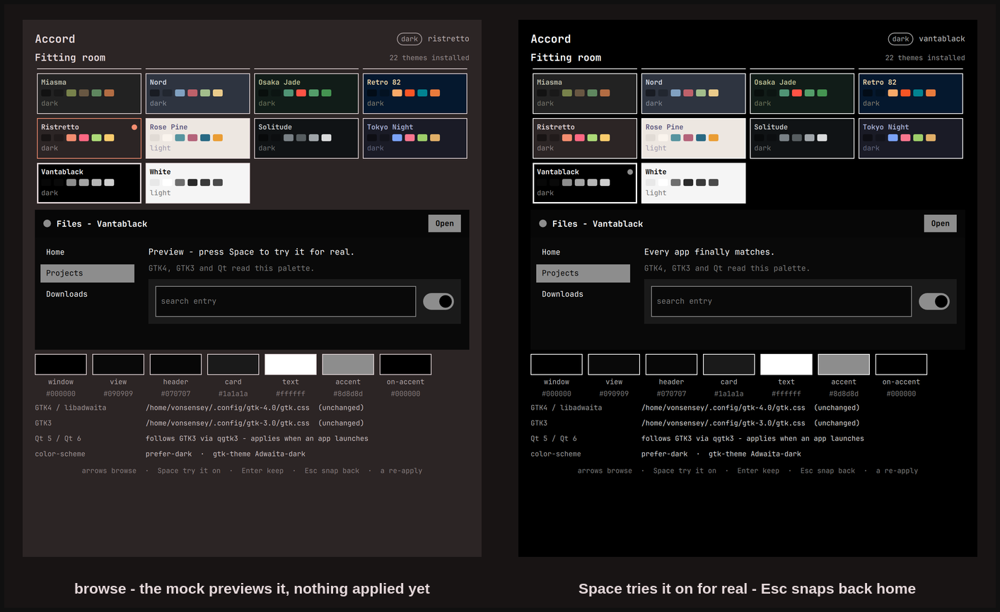
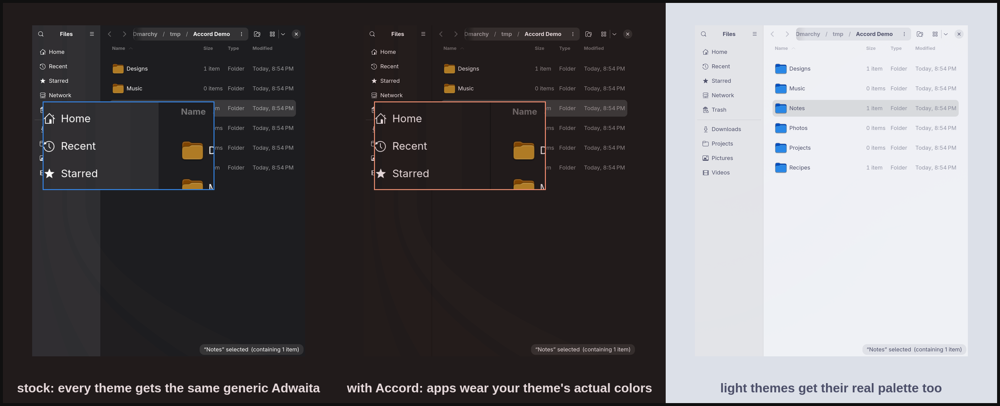

# Accord

**Omarchy themes your terminal, your editor, and its own shell beautifully.
Accord does the rest: GTK4, GTK3, and Qt apps follow your theme — light and
dark, live.**



Open Nautilus on a stock Omarchy box and it renders in generic Adwaita,
ignoring your theme's colors entirely. Omarchy flips those apps between light
and dark mode when you switch themes — but that is all they ever get: the same
default grey in every theme, never *your* background, *your* text color,
*your* accent. Your desktop wears Ristretto; your apps wear beige.



Accord closes that gap. Enable it once and every theme switch carries your
whole desktop with it:

- **GTK4 / libadwaita** apps (Nautilus, Calendar, Text Editor, Loupe, …) —
  themed through `~/.config/gtk-4.0/gtk.css`, the only user-level lever
  libadwaita honors.
- **GTK3** apps — themed through the classic named-color set in
  `~/.config/gtk-3.0/gtk.css`.
- **Qt 5 / Qt 6** apps — Omarchy ships `QT_QPA_PLATFORMTHEME=gtk3`, so Qt
  derives its default palette from the GTK3 theme Accord just wrote. No
  qt5ct, no Kvantum, no extra machinery.
- **Light and dark stay correct too.** Accord sets `color-scheme` and
  `gtk-theme` from the theme's declared mode — same values Omarchy's own
  `omarchy-theme-set-gnome` picks, kept correct even on setups where they
  drifted, and restored properly on revert.

## What you get

- A **service** that notices theme switches (including the symlink swap
  `omarchy-theme-set` performs, which file watchers miss) and re-applies
  within a few seconds.
- A **bar widget**: a dot wearing your current accent — read back from what
  was actually written, so the dot itself is proof the bridge ran. Click for
  the panel, right-click to re-apply.
- A **panel with a fitting room**: every installed theme as a card painted
  from its real palette, a mock app window that previews the selected theme
  before anything touches the system, and below it the exact palette on
  disk plus every file and setting Accord touched.

## The craft bits

- **On-accent text is chosen by luma distance** — whichever of the theme's
  background/foreground sits farther from the accent in perceived brightness.
  A naive "is the accent dark?" test fails on light themes. The test suite
  sweeps all 22 stock themes and asserts a minimum separation of 60/255;
  the worst case is miasma at 87.
- **Your gtk.css survives.** Accord manages a clearly marked block, backs up
  any pre-existing file once (`gtk.css.accord-backup`), puts its block *first*
  so your rules win conflicts, and `--revert` restores your original bytes
  exactly.
- **App restarts are surgical.** GTK4 apps read the user stylesheet only at
  process startup, so windowless daemons (Nautilus's background service and
  friends) keep painting stale colors until restarted. Accord SIGTERMs only a
  short allowlist of D-Bus-activatable apps, and **never one that owns a
  visible window** — those repaint on their next launch and the panel says so.
- **Idempotent and quiet.** Re-applying an unchanged theme writes nothing —
  byte-compared before write, so file watchers see zero churn.

Measured on Omarchy 4.0.0 (2026-08): one apply is a single short-lived
process — ~40 ms wall, ~19 MB peak RSS — writing 2.2 KB + 1.1 KB of CSS.
The resident service is a QML timer polling one `readlink` every 3 s.

## Install

```sh
omarchy plugin add https://github.com/vonsensey/accord --enable
```

Then add the **Accord** widget to your bar (Omarchy settings → Bar) if you
want the accent dot; the service themes your apps either way. Settings:
auto-apply on theme switch (On/Off) and restart of background GTK apps
(On/Off).

## The fitting room

Click the dot (or bind `omarchy-shell shell toggle io.github.vonsensey.accord`)
and the panel opens on a browsable rail of every theme you have installed —
stock and user themes alike, each card painted from its own palette, light
themes visibly light. Arrow keys move; the mock window previews what your
apps will look like in the selected theme *without touching anything*.

- **Space** tries it on for real: the full Omarchy theme switch plus the app
  bridge, so your whole desktop — shell, terminal, and every GTK/Qt app —
  wears the theme while the panel stays open.
- **Enter** keeps what you're wearing and closes.
- **Esc** snaps everything back to the theme you opened with and closes.
  Browse five themes, hate them all, press Esc — you're home.

The built-in switcher commits immediately; the fitting room lets you change
your mind. That is the same promise as the rest of Accord: nothing it does
is ever more than one keypress from undone.

## Remove

```sh
~/.config/omarchy/plugins/io.github.vonsensey.accord/bin/accord-apply --revert \
  && omarchy plugin disable io.github.vonsensey.accord \
  && rm -rf ~/.config/omarchy/plugins/io.github.vonsensey.accord \
            ~/.local/state/omarchy/accord
```

`--revert` restores your original `gtk.css` files (byte-identical, from the
one-time backups), removes what Accord created, and restores the
`color-scheme`/`gtk-theme` values it found on first run. If you edited a
file after Accord merged into it, revert keeps your newer content (minus
Accord's block) and leaves the backup in place for reference. Symlinked
`gtk.css` files (dotfiles setups) keep their symlink through both apply
and revert.

## What it writes, and what it does not

- **Writes exactly:**
  - `~/.config/gtk-4.0/gtk.css` and `~/.config/gtk-3.0/gtk.css` — a marked,
    replaceable block; pre-existing content is backed up once and preserved.
  - Two GNOME settings: `org.gnome.desktop.interface color-scheme` and
    `gtk-theme` — originals saved to state for revert.
  - `~/.local/state/omarchy/accord/state.json` (honoring `XDG_STATE_HOME`) —
    what was applied, for the widget and panel.
- **Reads:** the active theme's `colors.toml`; the two managed `gtk.css`
  files (to preserve your rules); its own state; the current values of the
  two gsettings keys (saved for revert); and the Hyprland window list +
  process names that the never-kill-a-window guard needs.
- **No network. Ever.** No elevation, no daemons, no writes anywhere else.
- The restart allowlist is exactly: nautilus, geary, gnome-calendar,
  gnome-text-editor, loupe, evince, snapshot — SIGTERM, windowless only.

## Limits, honestly

- **Qt apps pick the palette up at launch**, not live — qgtk3 reads the GTK
  theme when the app starts. Launch after a theme switch and it matches.
- **Qt apps that manage their own colors keep them.** OBS ships its own Yami
  theme; KDE apps can force a color scheme. The qgtk3 palette is the
  default, not an override.
- **GTK3 recoloring covers apps that use the standard named colors**
  (anything Adwaita-based — the default on Omarchy). A GTK3 app shipping its
  own hand-rolled theme may only partially follow.
- **Flatpak apps** need the usual hole punched to see host GTK config:
  `flatpak override --user --filesystem=xdg-config/gtk-4.0:ro <app>`.
- Accord recolors stock Adwaita rather than swapping widget themes — that is
  what keeps it a 3 KB CSS bridge instead of a theme engine.

## Test

```sh
bash test/check.sh
```

82 plain-bash assertions: palette mapping for dark and light fixtures,
on-accent contrast across every stock theme, marker-block preservation of
pre-existing user css, byte-identical revert (including symlinked and
non-UTF-8 files, and edits made after the merge), idempotent reruns,
self-healing of a truncated managed block, hermetic gsettings and
app-restart coverage via PATH shims, and graceful behavior on missing or
malformed theme input (exit 3, with the reason recorded in state.json),
and the fitting room's theme catalog (all 22 stock themes with full card
palettes, user-theme merging, broken themes skipped).

The generator is fully driveable without the shell for testing:
`ACCORD_THEME_DIR`, `ACCORD_GTK4_CSS`, `ACCORD_GTK3_CSS`,
`ACCORD_STATE_DIR`, and `ACCORD_NO_GSETTINGS=1` override every path it
touches, exactly as `test/check.sh` uses them.
